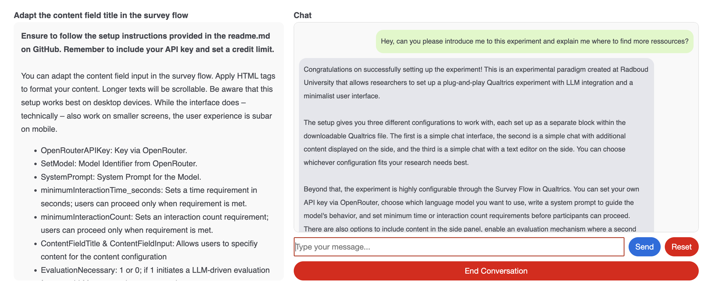
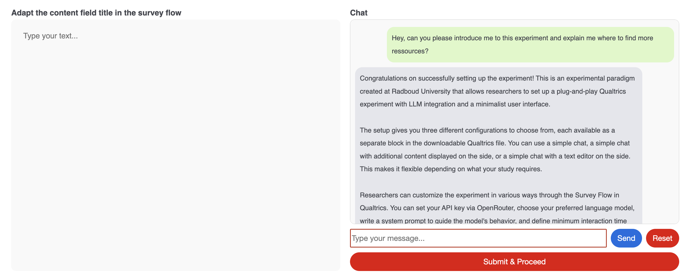

# Talk2LLM_UI: A qualtrics-based plug-and-play experiment on Human-LLM interaction

Talk2LLM_UI is a Qualtrics-based experimental user interface for chat-like interactions with state-of-the-art LLMs. It requires little to no coding experience while allowing for a wide array of configurations. This includes a standalone chat, a chat with accompanying content on the side and a chat with an additional text editor (e.g., for studies focusing on LLMs as writing assistants). Additional customization options further enable researchers to tailor the setup to their specific needs.

<table>
  <tr>
    <td align="center" width="33%">
       
      Chat Only
    </td>
    <td align="center" width="33%">
       
      Chat + Content
    </td>
    <td align="center" width="33%">
       
      Chat + Editor
    </td>
  </tr>
</table>

## Setup
Talk2LLM_UI includes a plug-and-play QSF file that can be imported directly into Qualtrics. The following steps guide you to setting up your experiment. 

1. Download the Chat_Template.qsf and import the downloaded file. For guidance on how to import qualtrics files please see [the official Qualtrics Documentation](https://www.qualtrics.com/support/survey-platform/survey-module/survey-tools/import-and-export-surveys/). 
2. Setup the API Key
- Register to [Openrouter](https://openrouter.ai/). 
- Acquire credits (e.g., 25$). 
- Create an API key. 
- As API requests are transmitted on the client device, it is possible (although unlikely) for participants to access your API key. Therefore, please make sure to set a limit for the API key. DO NOT SKIP THIS STEP! 
- After setting the limit, copy the API code, go to the Qualtrics survey flow and past the key in the embedded data field "OpenRouterAPIKey".
3. Preview the experiment and check basic functionality.

## Usage
After following the steps outlined above the experiment is ready to use. However, multiple customization options are available, including the model, response prompts, evaluation prompts or the order of interaction. 

1. Configuration
The three configurations are available as separate blocks within the downloadable qualtrics file. Simply delete those blocks not relevant for your setup.

- Chat_Only: This configuration includes the chat only.
- Chat_Content: This configuration includes a sidepanel on the left with additional content (e.g., texts or a Stimulus).
- Chat_Editor: This configuration includes a rudimentary text editor on the left and the option to submit the text (e.g., to study how LLM-support impacts writing). 

2. Customization
There is a series of variables that are embedded via Qualtrics. Adapting these variables changes the setup:

 - OpenRouterAPIKey: Key via OpenRouter.  
 - setModel: Model Identifier from OpenRouter. 
 - SystemPrompt: System Prompt for the Model. 
 - minimumInteractionTime_seconds: Sets a time requirement in seconds; users can proceed only when requirement is met. 
 - minimumInteractionCount: Sets an interaction count requirement; users can proceed only when requirement is met. 
 - EvaluationNecessary: 1 or 0; if 1 initiates a LLM-driven evaluation for every LLM-generated response and regenerates a new response if initial response does not fulfil the requirements set in the EvaluationPrompt
 - EvaluationPrompt: Prompt to check LLM-generated response; the output of this Prompt must be NO or YES; only NO allows the response to be presented to the participant. 
 - LLMinitiates: 1 or 0; if 1 the model will generate a response first. 
 - LLMinitiates_StartPrompt: Sets the first prompt necessary for the model to initiate the conversation. 
 - LLMinitiates_Visible: 1 or 0; if 1 LLMinitiates_StartPrompt will be visible to the participant."
 - LLMinitiates_RepeatOnReset: 1 or 0; if 1 LLMinitiates will be active after every reset.
 - ConversationHistory: Placeholder for conversation data.

Only relevant for the editor configuration:
 - Article: Placeholder for text input.
 - ArticleMinimumLength: Minimum length for text input in editor configuration.
 - ContentFieldTitle & ContentFieldInput: Allows users to specify content for the content configuration

## Contributing

Pull requests are welcome. For major changes, please open an issue first
to discuss what you would like to change.

Please make sure to update tests as appropriate.

## License

Apache-2.0
